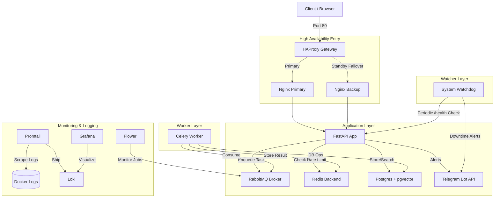

# Machine Learning & Background Jobs Stack

This project is a high-performance, containerized microservices architecture designed for machine learning workflows and intensive background task processing. It features High Availability (HA) routing, vector database support, real-time monitoring, and a **Proactive Telegram Alerting System**.

## 🏗 Architecture & Flow

The following diagram illustrates the data flow and component relationships, including the new monitoring layer:



---

## 🚀 Quick Start Guide

### 1. Prerequisites

- **Docker & Docker Compose**: [Download here](https://www.docker.com/products/docker-desktop)
- **Git**: To clone the repository.
- **Telegram Account**: To set up monitoring alerts.

### 2. Setup & Installation

1. **Clone the Repository**:

    ```bash
    git clone <repository-url>
    cd ml
    ```

2. **Configure Environment**:
    Inside the `background-jobs` directory, edit the `.env` file to add your secrets:

    ```bash
    cd background-jobs
    cp .env.example .env  # If not already present
    ```

3. **Launch the System**:

    ```bash
    docker-compose up --build -d
    ```

---

## ⚙️ Environment Variables

Before running the stack, ensure you have a `.env` file in the `background-jobs` directory. Below are the critical variables required:

### 📡 Telegram Monitoring
| Variable | Required | Description |
| :--- | :--- | :--- |
| `TELEGRAM_BOT_TOKEN` | Yes | Token from [@BotFather](https://t.me/BotFather). |
| `TELEGRAM_CHAT_ID` | Yes | Your numeric Chat ID (from `@userinfobot`). |

### 🗄️ Database (PostgreSQL)
| Variable | Default | Description |
| :--- | :--- | :--- |
| `POSTGRES_USER` | `myuser` | Database administrator username. |
| `POSTGRES_PASSWORD` | `mypassword` | Database password. |
| `POSTGRES_DB` | `ml_database` | Name of the primary database. |
| `DATABASE_URL` | `postgresql://...` | Full SQLAlchemy connection string. |

### 📨 Messaging & Tasks (RabbitMQ/Redis)
| Variable | Default | Description |
| :--- | :--- | :--- |
| `CELERY_BROKER_URL` | `amqp://...` | RabbitMQ connection URL for task distribution. |
| `CELERY_RESULT_BACKEND` | `redis://...` | Redis URL for storing background job results. |

### 🌐 Infrastructure
| Variable | Default | Description |
| :--- | :--- | :--- |
| `BASE_URL` | `http://localhost:8000` | The primary URL where the API is hosted internally. |

---

## 🤖 Telegram Monitoring Setup

This project uses a proactive monitoring system that alerts you if the server goes down or if the backend encounters internal errors.

### Step 1: Create a Telegram Bot

1. Open Telegram and search for **@BotFather**.
2. Send `/newbot` and follow the instructions to name your bot.
3. **Save the API Token** provided (e.g., `123456789:ABCDefgh...`).

### Step 2: Get your Chat ID

1. Search for **@userinfobot** in Telegram.
2. Send any message to it, and it will reply with your **Id** (a series of numbers).
3. *Note: If you want to send alerts to a group, add the bot to the group and use a bot like @combybot to find the group's Chat ID.*

### Step 3: Configure `.env`

Open `background-jobs/.env` and fill in the following:

```env
TELEGRAM_BOT_TOKEN=your_token_from_botfather
TELEGRAM_CHAT_ID=your_id_from_userinfobot
```

### Step 4: Verify the Connection

Once configured and the system is running:

- Visit `http://localhost/health` to see the live status of all services.
- If you stop the database (`docker-compose stop db`), you will receive a Telegram alert within 60 seconds.

---

## 🛠 Internal Access Points

| Service | URL | Credentials | Description |
| :--- | :--- | :--- | :--- |
| **Main API** | [http://localhost](http://localhost) | - | Production entry via HAProxy |
| **API Docs** | [http://localhost/docs](http://localhost/docs) | - | Interactive Swagger UI |
| **System Health** | [http://localhost/health](http://localhost/health) | - | **Live status of DB, Redis, Celery** |
| **Celery (Flower)** | [http://localhost/flower/](http://localhost/flower/) | - | Background job dashboard |
| **Grafana** | [http://localhost:3000](http://localhost:3000) | `admin` / `admin` | Log visualization (Loki) |
| **HAProxy Status** | [http://localhost:1936](http://localhost:1936) | `admin` / `admin` | Load balancer health |
| **RabbitMQ** | [http://localhost:15672](http://localhost:15672) | `guest` / `guest` | Message queue management |

---

## 🚦 System Features & Workflow

### 🟢 High Availability

- **HAProxy**: Monitors two Nginx instances. If the primary instance fails, traffic is instantly routed to the backup.
- **Failover Testing**: Run `docker-compose stop ml_nginx_primary` and notice the site stays up!

### 🔴 Intelligent Alerting

- **Exception Catcher**: Any 500 error in the API is instantly sent to your Telegram with the error type and relevant request headers.
- **Watchdog**: A standalone service pings the system health every minute. If the entire server crashes, you get a "System Down" notification.

### 🟡 ML-Ready Storage

- **pgvector**: The PostgreSQL database is pre-configured with the `vector` extension, allowing you to store and search machine learning embeddings directly.

### 🟣 Centralized Logging

- **Loki & Promtail**: All container logs are centralized.
- **View Logs**: Open Grafana → Explore → Select Loki → Query `{container="ml_api"}`.

---

## 📝 Troubleshooting

- **Containers won't start?** check `docker compose ps` and `docker compose logs`.
- **No Telegram messages?** Double-check your `TELEGRAM_BOT_TOKEN` and ensure your bot isn't muted.
- **Service Unhealthy?** Check the `/health` endpoint output for specific service errors (e.g., "no active workers found").

---

> [!TIP]
> This stack is built for scale. You can add more workers by running `docker-compose up -d --scale worker=3`.
